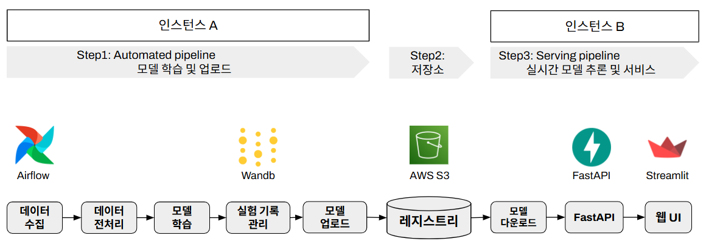
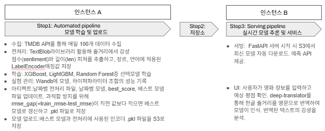
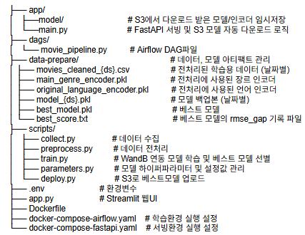

# Airflow MLOps Project
## 0. TMDB Movie Score Predictor
- 영화 평점 예측 서비스 개발 및 MLOps 파이프라인 구축
- AWS S3 기반의 모델 레지스트리를 활용하여 데이터 수집부터 배포까지 자동화한 MLOps 파이프라인 프로젝트
## 1. 아키텍처
- 학습 인스턴스 A: Airflow를 통한 데이터 수집, 전처리, 학습 및 WandB 실험 기록 관리
- 모델 레지스트리 (AWS S3): 모델 아티팩트(Model & Encoder) 저장소
- 서빙 인스턴스 B: FastAPI를 통한 예측 API 제공 및 Streamlit UI 서비스
 


## 2. Tree
 

## 3. 핵심 기술 스택
- Orchestration: Apache Airflow
- Experiment Tracking: Weights & Biases (WandB)
- Model Registry: AWS S3
- Serving: FastAPI, Streamlit, Docker
- ML Model: XGBoost, LightGBM, Random Forest regressor

## 4. 설치 및 실행
```
# 환경변수 설정 (.env)
TMDB_API_KEY=
WANDB_API_KEY=
AWS_ACCESS_KEY_ID=
AWS_SECRET_ACCESS_KEY=
S3_BUCKET_NAME=
AIRFLOW__WEBSERVER__SECRET_KEY=

# 학습 환경 실행 (Instance A)
docker-compose -f docker-compose-airflow.yaml up -d

# 서빙 환경 실행 (Instance B)
docker-compose -f docker-compose-fastapi.yaml up -d
```
## 5. 주요 기능
- Automated Training: Airflow를 통한 주기적 모델 재학습 및 성능 비교 자동화
- Sentiment Analysis: TextBlob을 활용한 영화 개요 감성 점수 파생 변수 생성
- Model Versioning: S3 기반 모델 관리 및 서빙 서버 자동 동기화
- Scale-out: 학습과 서빙 리소스 간섭 방지를 위한 인스턴스 분리 설계


