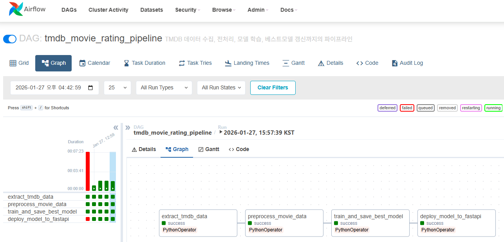

# MLOps Project: TMDB Movie Score Predictor
- 영화 평점 예측 서비스 개발 및 MLOps 파이프라인 구축
- AWS S3 기반의 모델 레지스트리를 활용하여 데이터 수집부터 배포까지 자동화한 MLOps 파이프라인 프로젝트

## 0. 프로젝트 개요와 목표
- 영화 제작사/배급사가 개봉 전 예상 평점을 알면 마케팅 전략과 개봉 시기를 최적화 가능
- 영화 메타데이터 기반 평점 예측 모델 개발
- 자동화된 MLOps 파이프라인 구축으로 지속적 모델 개선

## 1. 결과
| 메트릭 | 값 |
|--------|-----|
| Best Model | XGBoost |
| RMSE | 0.92 |
| MAE | 0.83 |
| 학습 자동화 주기 | Daily |
| 배포 소요시간 | < 5분 |

## 2. 아키텍처
- 학습 인스턴스 A: Airflow를 통한 데이터 수집, 전처리, 학습 및 WandB 실험 기록 관리
- 모델 레지스트리 (AWS S3): 모델 아티팩트(Model & Encoder) 저장소
- 서빙 인스턴스 B: FastAPI를 통한 예측 API 제공 및 Streamlit UI 서비스
 


## 3. Tree
```
├── app/
│   ├──model/                            # S3에서 다운로드 받은 모델/인코더 임시저장
│   └──main.py                           # FastAPI 서빙 및 S3 모델 자동 다운로드 로직
├── dags/
│   └── movie_pipeline.py                # Airflow DAG파일
├── data-prepare/                        # 데이터, 모델 아티팩트 관리
│ ├── movies_cleaned_{ds}.csv            # 전처리된 학습용 데이터 (날짜별)     
│ ├── main_genre_encoder.pkl             # 전처리에 사용된 장르 인코더
│ ├── original_language_encoder.pkl      # 전처리에 사용된 언어 인코더     
│ ├── model_{ds}.pkl                     # 모델 백업본 (날짜별)
│ ├── best_model.pkl                     # 베스트 모델
│ └── best_score.txt                     # 베스트 모델의 rmse_gap 기록 파일
├── src/                
│   ├── collect.py                       # 데이터 수집
│   ├── preprocess.py                    # 데이터 전처리
│   ├── train.py                         # WandB 연동 모델 학습 및 베스트 모델 선별
│   ├── parameters.py                    # 모델 하이퍼파라미터 및 설정값 관리
│   └── deploy.py                        # S3로 베스트모델 업로드
├── .env                                 # 환경변수
├── app.py                               # Streamlit 웹UI
├── Dockerfile                      
├── docker-compose-airflow.yaml          # 학습환경 실행 설정
└── docker-compose-fastapi.yaml          # 서빙환경 실행 설정
```

## 4. 파이프라인 상세


1. extract_tmdb_data: TMDB API에서 최신 영화 데이터 수집
2. preprocess_movie_data: 결측치 처리, 피처 엔지니어링
3. train_and_save_best_model: 3개 모델 비교 학습, WandB 로깅
4. deploy_model_to_s3: Best 모델 S3 업로드, 서빙 서버 동기화

## 5. 핵심 기술 스택
- Orchestration: Apache Airflow
- Experiment Tracking: Weights & Biases (WandB)
- Model Registry: AWS S3
- Serving: FastAPI, Streamlit, Docker
- ML Model: XGBoost, LightGBM, Random Forest regressor

## 6. 기술적 의사결정
### Q: 왜 Airflow를 선택?
- 복잡한 의존성 관리 용이
- 실패 시 재시도/알림 기능
- 스케줄링 유연성
### Q: 왜 학습/서빙 인스턴스를 분리?
- 학습 시 GPU 리소스 집중 가능
- 서빙 안정성 확보
- 실제 프로덕션 환경과 유사

## 7. 설치 및 실행
```
# 환경변수 설정 (.env)
TMDB_API_KEY=
WANDB_API_KEY=
AWS_ACCESS_KEY_ID=
AWS_SECRET_ACCESS_KEY=
S3_BUCKET_NAME=
AIRFLOW__WEBSERVER__SECRET_KEY=

# 학습 환경 실행 (Instance A)
docker-compose -f docker-compose-airflow.yaml up -d

# 서빙 환경 실행 (Instance B)
docker-compose -f docker-compose-fastapi.yaml up -d
```
## 8. 주요 기능
- Automated Training: Airflow를 통한 주기적 모델 재학습 및 성능 비교 자동화
- Sentiment Analysis: TextBlob을 활용한 영화 개요 감성 점수 파생 변수 생성
- Model Versioning: S3 기반 모델 관리 및 서빙 서버 자동 동기화
- Scale-out: 학습과 서빙 리소스 간섭 방지를 위한 인스턴스 분리 설계


